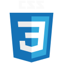
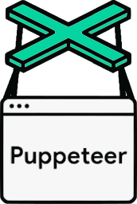
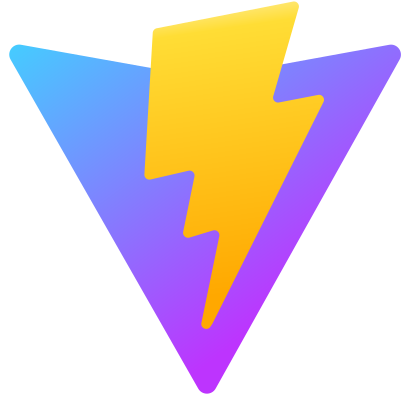

## Hey 👋, I'm Alexey Koran

[![LinkedIn](https://img.shields.io/badge/linkedin-%231E77B5.svg?&style=for-the-badge&logo=data:image/svg+xml;base64,PD94bWwgdmVyc2lvbj0iMS4wIiBlbmNvZGluZz0iVVRGLTgiPz4KPHN2ZyB3aWR0aD0iMjU2cHgiIGhlaWdodD0iMjU2cHgiIHZpZXdCb3g9IjAgMCAyNTYgMjU2IiB2ZXJzaW9uPSIxLjEiIHhtbG5zPSJodHRwOi8vd3d3LnczLm9yZy8yMDAwL3N2ZyIgeG1sbnM6eGxpbms9Imh0dHA6Ly93d3cudzMub3JnLzE5OTkveGxpbmsiIHByZXNlcnZlQXNwZWN0UmF0aW89InhNaWRZTWlkIj4KICAgIDxnPgogICAgICAgIDxwYXRoIGQ9Ik0yMTguMTIzMTIyLDIxOC4xMjczOTIgTDE4MC4xOTE5MjgsMjE4LjEyNzM5MiBMMTgwLjE5MTkyOCwxNTguNzI0MjYzIEMxODAuMTkxOTI4LDE0NC41NTkwMjMgMTc5LjkzOTA1MywxMjYuMzIzOTkzIDE2MC40NjM3NTYsMTI2LjMyMzk5MyBDMTQwLjcwNzkyNiwxMjYuMzIzOTkzIDEzNy42ODUyODQsMTQxLjc1NzU4NSAxMzcuNjg1Mjg0LDE1Ny42OTI5ODYgTDEzNy42ODUyODQsMjE4LjEyMzQ0MSBMOTkuNzU0MDg5NCwyMTguMTIzNDQxIEw5OS43NTQwODk0LDk1Ljk2NjUyMDcgTDEzNi4xNjgwMzYsOTUuOTY2NTIwNyBMMTM2LjE2ODAzNiwxMTIuNjYwNTYyIEwxMzYuNjc3NzM2LDExMi42NjA1NjIgQzE0NC4xMDI3NDYsOTkuOTY1MDAyNyAxNTcuOTA4NjM3LDkyLjM4MjQ1MjggMTcyLjYwNTY4OSw5Mi45MjgwMDc2IEMyMTEuMDUwNTM1LDkyLjkyODAwNzYgMjE4LjEzODkyNywxMTguMjE2MDIzIDIxOC4xMzg5MjcsMTUxLjExNDE1MSBMMjE4LjEyMzEyMiwyMTguMTI3MzkyIFogTTU2Ljk1NTA1ODcsNzkuMjY4NTI4MiBDNDQuNzk4MTk2OSw3OS4yNzA3MDk5IDM0Ljk0MTM0NDMsNjkuNDE3MTc5NyAzNC45MzkxNjE4LDU3LjI2MDA1MiBDMzQuOTM2OTgsNDUuMTAyOTI0NCA0NC43OTAyOTQ4LDM1LjI0NTg1NjIgNTYuOTQ3MTU2NiwzNS4yNDM2NzM2IEM2OS4xMDQwMTg1LDM1LjI0MTQ5MTYgNzguOTYwODcxMyw0NS4wOTUwMjE3IDc4Ljk2MzA1NCw1Ny4yNTIxNDkzIEM3OC45NjQxMDE3LDYzLjA5MDIwOCA3Ni42NDU5OTc2LDY4LjY4OTU3MTQgNzIuNTE4Njk3OSw3Mi44MTg0NDMzIEM2OC4zOTEzOTgyLDc2Ljk0NzMxNTMgNjIuNzkyOTg5OCw3OS4yNjc0OCA1Ni45NTUwNTg3LDc5LjI2ODUyODIgTTc1LjkyMDY1NTgsMjE4LjEyNzM5MiBMMzcuOTQ5OTUsMjE4LjEyNzM5MiBMMzcuOTQ5OTUsOTUuOTY2NTIwNyBMNzUuOTIwNjU1OCw5NS45NjY1MjA3IEw3NS45MjA2NTU4LDIxOC4xMjczOTIgWiBNMjM3LjAzMzQwMywwLjAxODI1NzcwOTEgTDE4Ljg4OTUyNDksMC4wMTgyNTc3MDkxIEM4LjU3OTU5NDY5LC0wLjA5ODA5MjM5NzEgMC4xMjQ4MjcwMzgsOC4xNjA1NjIzMSAtMC4wMDEsMTguNDcwNjA2NiBMLTAuMDAxLDIzNy41MjQwOTEgQzAuMTIwNTE5MDUyLDI0Ny44MzkxMDMgOC41NzQ2MDYzMSwyNTYuMTA1OTM0IDE4Ljg4OTUyNDksMjU1Ljk5NzcgTDIzNy4wMzM0MDMsMjU1Ljk5NzcgQzI0Ny4zNjg3MjgsMjU2LjEyNTgxOCAyNTUuODU1OTIyLDI0Ny44NTk0NjQgMjU1Ljk5OSwyMzcuNTI0MDkxIEwyNTUuOTk5LDE4LjQ1NDgwMTYgQzI1NS44NTE2MjQsOC4xMjQzODk3OSAyNDcuMzYzNzQyLC0wLjEzMzc5Mjg2OCAyMzcuMDMzNDAzLDAuMDAwNzkwODA3MDU1IiBmaWxsPSIjZmZmZmZmIj48L3BhdGg+CiAgICA8L2c+Cjwvc3ZnPgo=)](https://linkedin.com/in/alexey-koran)

<!--

-->

### About

Since 2016, I have worked as a software engineer, mainly in web development

Actual stack: TypeScript, React, Next.js, GraphQL, Relay/Apollo

<h2>Rapidfire</h2>

- 🇬🇧 English - B1/B2

- 🎓 Bachelor of Science in Software Engineering, [BSUIR](https://en.wikipedia.org/wiki/Belarusian_State_University_of_Informatics_and_Radioelectronics)

- 🧑‍🎓 Trainer, mentor and activist at [RS School](https://rs.school/) (volunteer)

- 🏅 Mentored 18 students in 4 [JavaScript/Front-End](https://rs.school/courses/javascript) and 3 [React](https://rs.school/courses/reactjs) courses

- 🔭 I’m currently working on [RS School assignments](https://rs.school/courses)

  Prepare own materials for further mentoring

- 🌱 I’m currently learning [Nest.js](https://nestjs.com/) & [Express](https://expressjs.com/)

<h2>Experience</h2>

| Company               | Title                     | Start          | End           |
| --------------------- | ------------------------- | -------------- | ------------- |
| Outsource             | Senior Frontend Developer | November 2024  | March 2025    |
| Specific-Group Poland | Senior Frontend Developer | March 2023     | August 2024   |
| Outsource             | Senior Frontend Developer | February 2021  | March 2023    |
| Pythia                | Full Stack Engineer       | April 2020     | February 2021 |
| Tubapak               | Software Engineer         | October 2017   | August 2019   |
| Tubapak               | Software Technician       | September 2016 | October 2017  |

<h2>Education</h2>

| Education institution name                                                                  | Degree     | Field of study                  | Qualification       | Start | End  |
| ------------------------------------------------------------------------------------------- | ---------- | ------------------------------- | ------------------- | ----- | ---- |
| [Belarusian State University of Informatics and Radioelectronics](https://www.bsuir.by/en/) | Bachelor's | Information technology software | Software engineer   | 2016  | 2021 |
| [Minsk College of Business](https://www.mcb.by/)                                            | Specialist | Information technology software | Software technician | 2012  | 2016 |

<h2>Languages and tools</h2>

## Github Stats

<table>
  <tr>
    <td valign="top" width="50%">
      
    </td>
    <td valign="top" width="50%">
      
    </td>
  </tr>
  <tr>
    <td>
      
    </td>
  </tr>
</table>
